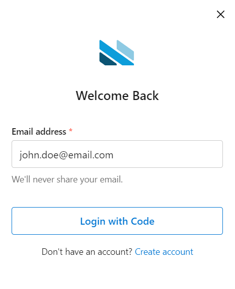
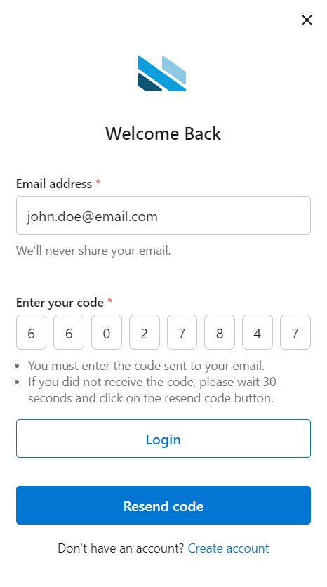
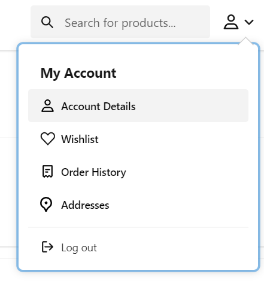
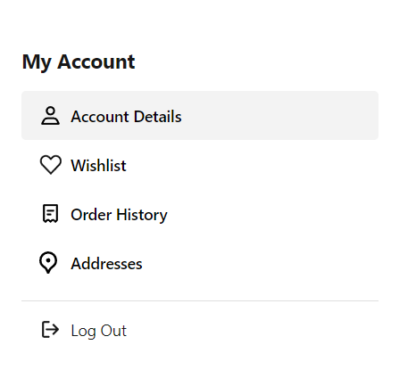
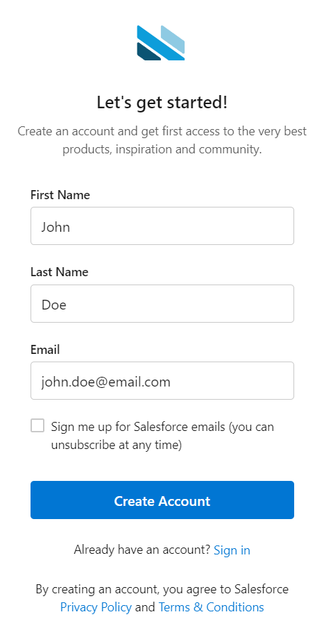

# Salesforce Commerce Cloud (SFCC) One-Time Password Login for PWA Kit

SFCC One-Time Password Login for PWA Kit is a package that implements the feature of login without the need of a password to Salesforce Commerce Cloud Composable Storefront.

## Features

SFCC One-Time Password Login for PWA Kit provides the following features:

- Register account without password
- Login by using OTP code sent to registered email
- OTP code resend functionality
- Secure UI messaging brute force attack proof
- Secure logout

## Prerequisites

1. SFCC One-Time Password Login for PWA Kit is designed to work with Salesforce PWA Kit, so in order to use this package you will need to create a local project using the React Retail App template. Run the following command to create a new project:

	```shell
	npx @salesforce/pwa-kit-create-app@latest
	```
    Remember that you need to choose the option to use the *Retail app using your own Commerce Cloud Instance* and choose *Yes* when asked if you want to use template extensibility. 
	For more information regarding the creation and usage of the React Retail App refer to the [Salesforce Developer documentation page](https://developer.salesforce.com/docs/commerce/pwa-kit-managed-runtime/guide/getting-started.html)

2. SFCC One-Time Password Login for PWA Kit requires that you set up a public SLAS client ID for your PWA Kit application. For this step, please follow the instructions in the Salesforce [Set Up API Access](https://developer.salesforce.com/docs/commerce/pwa-kit-managed-runtime/guide/setting-up-api-access.html) guide

3. SFCC One-Time Password Login for PWA Kit also requires that you set up a private SLAS client ID for your PWA Kit application. In order to do this go through the following steps:

    3.1. Go to SLAS Admin UI which you can access at https://<your-short-code>.api.commercecloud.salesforce.com/shopper/auth-admin/v1/sso/login

    3.2. Go to the *Clients* section and click on the **Add Client** button. In the creation form select your organization ID from the tenant select and select *BFF or Web App* option in the app type select

    3.3. Uncheck the option that asks you to use the default shopper scopes and in the input field underneath, put the following shopper scopes: *sfcc.shopper-myaccount.baskets sfcc.shopper-products sfcc.shopper-myaccount.rw sfcc.shopper-customers.login sfcc.shopper-stores sfcc.pwdless_login sfcc.shopper-customers.register sfcc.shopper-myaccount.addresses.rw sfcc.shopper-productlists sfcc.shopper-promotions sfcc.shopper-baskets-orders.rw sfcc.shopper-gift-certificates sfcc.shopper-product-search sfcc.shopper-myaccount.productlists sfcc.shopper-categories*. Make sure that each scope is separated by a space

    3.4. After clicking the **Submit** button the private client will be created and on top most part of the page you will see a confirmation message showing the client Id and the secret key, please copy this key and store it in a safe place, because it WILL be needed for this package to properly work. If you lose this secret key you will need to create a new private client, since there is no way to see the value again

## Installation

SFCC One-Time Password Login for PWA Kit offers two things: the modifications for PWA Kit and a SFRA cartridge

1. The PWA Kit modifications are provided to template extensibility, if you enabled extensibility as requested in the first step of the Prerequisites section, your project should be ready to use the base template of this integration. In order to install the base template, run the following command:

    ```shell
	npm i @appspringtechsas/sfcc-otp-login-integration
	```

2. In order to make your project extendable from SFCC One-Time Password Login for PWA Kit, you need to go to your *package.json* file and in there, you will find a section called **ccExtensibility**. Modify the value of the **extends** property, replace the value with *@appspringtechsas/sfcc-otp-login-integration* and save the changes

3. After modifying the *package.json* of your project, go to *config/default.js* and add a the following entry in *proxyConfigs*:

     ```javascript
    {
        host: '<Your-Realm-ID>.dx.commercecloud.salesforce.com',
        path: 'controller'
    }
	```
    This new proxy configuration is needed for the calls to the SFRA controller that the package provides

4. Routes file also needs modification, because the routes are imported from the Salesforce Retail React App by default. In all imports, replace the portions that contain *@salesforce/retail-react-app/* with *@appspringtechsas/sfcc-otp-login-integration/*. This will cause that routes are imported from SFCC One-Time Password Login for PWA Kit

5. Run the commands *npm i* and then, *npm run build*

6. A SFRA cartridge is also needed for the integration package to work. The cartridge and the controllers are inside *sfra-cartridges/* folder. For all the details on how to install *email_passwordless_login* cartridge, please refer to the [cartridge README](./sfra-cartridges/README.md)

After following the steps, you should be ready to use SFCC One-Time Password Login for PWA Kit

## Usage

SFCC One-Time Password Login for PWA Kit package allows storefront users to register and to log in without the necessity of a password, providing more security and a better user experience when using a site built with Salesforce Commerce Cloud Composable Storefront.

PWA Kit by default requires password for registering and to log into the storefront site, SFCC One-Time Password Login for PWA Kit creates new components and modify existing ones along with their functionalities in order to remove passwords from PWA Kit while keeping the normal behavior of the storefront, this means that users will not be limited in any way, they will still be able to browse the catalog, buy products, add products to the wishlist, modify their personal information, etc.

SFCC One-Time Password Login for PWA Kit modifies the login form by removing the password field, users only needs to enter their email and then, the form will show a message saying that an email with the OTP code will be sent if they are registered.



Aditionally, the form will now display: a new input field for the OTP code with some information underneath and a **Resend code** button.

If the user is registered, they should see a mail in ther email account which shows the OTP code for login (the code has a 10 minutes validity). This code needs to be entered in the OTP input field of the login form, the user can type digit by digit or they can copy and paste the code directly in the input field. If user is not registered, no code or email will be sent to the provided email address, therefore user needs to make sure they registered previously.




As mentioned before, the login form also provides a **Resend code** button which allows the user to request the code again in case it was not successfully sent the first time. This button is enabled 30 seconds after the first OTP code request and it will be disabled for 30 seconds right after the user request a code resend. Code resend request are limited to 3 times in a certain period of time.

After the user enters the OTP code in the input field, they can press the **Login** button and they will be successfully logged into the storefront site. If the user wants to logout, they can do so by selecting the **Logout** option on the header menu or by accessing the **Account Details** page and clicking **Logout** on the left side of the page.





Registration has also been modified by SFCC One-Time Password Login for PWA Kit package: users can now registrate without having to provide a password. The registration form has been modified in order to remove the password field and users can create their account through a simple process: provide first and last name and the email, press the **Create Account** button and the account will be created.



Please refer to this [link](https://www.youtube.com/watch?v=u1i518SlSlY&t=2s&ab_channel=AppspringDevelopmentInc) in which you will find a video that shows all the features of the package already implemented in the Salesforce Commerce Cloud Composable Storefront.